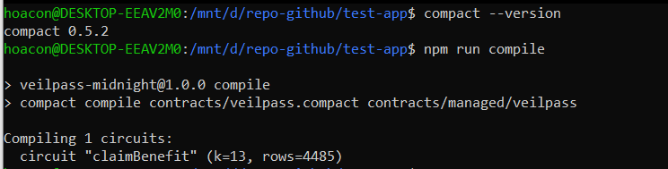
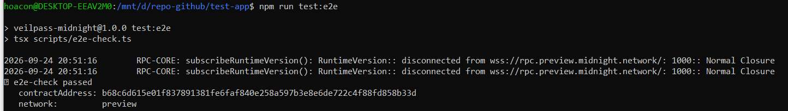
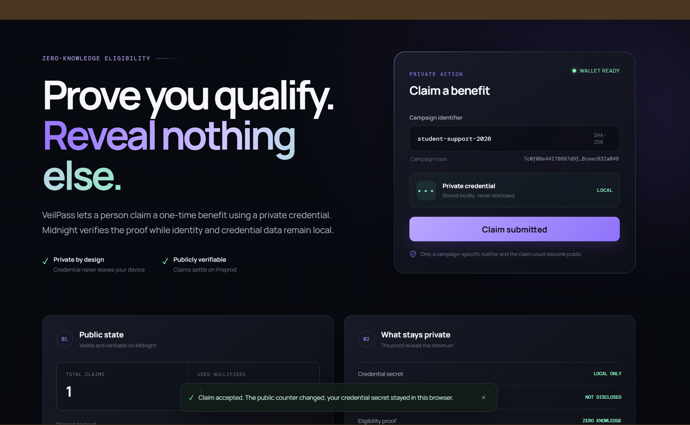

# VeilPass

VeilPass is a privacy-first eligibility and benefit-claiming DApp built with Compact and Midnight.js. The repository contains the Level 1 contract/toolchain foundation and the Level 2 — Waxing Crescent Lace-connected frontend for RiseIn's *New Moon to Full: Monthly Moonshots on Midnight* program.

## Level 2 web DApp

The React frontend in `web/` provides the complete browser claim flow:

- detects a compatible Lace wallet through DApp Connector API 4.x;
- connects to Midnight **Preprod** and supports a local disconnect;
- joins the deployed VeilPass contract and invokes the `claimBenefit` circuit;
- generates the credential secret in the browser and keeps it in local private state;
- reads only the public aggregate claim count and used-nullifier count from the Preprod indexer;
- explains exactly what is private and what is deliberately disclosed.

The frontend follows the provider pattern in Midnight's official browser examples and uses Midnight.js `4.1.1`, matching the Compact `0.31.1` / runtime `0.16.0` artifacts committed in this repository.

## Product idea

VeilPass lets a university, public agency, or community program issue an eligibility credential that a person can later use to claim a benefit without publishing their identity or the credential itself. A zero-knowledge circuit derives a campaign-specific nullifier from the holder's private credential secret, allowing the network to reject duplicate claims while making claims across different campaigns difficult to link. Levels 4–6 will extend this foundation with issuer-approved credential commitments, expiry and eligibility rules, plus a simple web interface for issuers and claimants.

Track/category: **Identity & credentials** (with Consumer & Social applications).

## What the Level 1 contract does

The Compact contract exposes two circuits:

- `credentialCommitment(secret)` derives a deterministic commitment from a 32-byte credential secret.
- `claimBenefit(campaignId)` derives and deliberately discloses a campaign-specific nullifier, rejects reuse of that nullifier, and increments the aggregate claim count.

The second circuit is compiled to a zero-knowledge circuit. Its generated ZKIR, prover key, verifier key, JavaScript bindings, and compiler metadata are committed under `contracts/managed/veilpass/`.

## Public state vs private witness

`credentialSecret()` is a **private witness**. It is generated locally, stored in Midnight's encrypted private-state provider, and supplied to the circuit during proof construction. It is never written to the public ledger.

The public ledger contains only:

- `usedNullifiers`: opaque hashes used to enforce one claim per credential per campaign;
- `totalClaims`: an aggregate counter.

Inside `claimBenefit`, `disclose()` is used deliberately on the derived nullifier—not on the credential secret. This makes duplicate detection publicly verifiable while keeping the underlying credential private. The Level 1 prototype does not yet validate an issuer signature or eligibility policy; those are explicitly part of the Level 4–6 roadmap.

## Requirements

- Ubuntu under WSL2 (recommended on Windows)
- Node.js 22
- Docker Desktop with WSL integration and Docker Compose
- Compact developer tools and compiler `0.31.1`

Install/select the compiler:

```bash
compact update 0.31.1
compact use 0.31.1
```

## Run locally

All commands below should be run from Ubuntu/WSL in the project directory.

```bash
npm install
npm run compile
npm test
npm run build
```

Run the Lace-connected frontend:

```bash
cd web
npm install
npm run dev
```

Then open `http://localhost:5173`, unlock Lace, select Preprod, and click **Connect Lace**. For a production build, run `npm run web:build` from the repository root.

A successful compile prints `Compiling 1 circuits:` and creates:

```text
contracts/managed/veilpass/
├── compiler/contract-info.json
├── contract/index.js
├── keys/claimBenefit.prover
├── keys/claimBenefit.verifier
└── zkir/claimBenefit.zkir
```

## Deploy

The deployment scripts support local, Preview, and Preprod networks. They generate a wallet per public network, start/use the proof server, persist encrypted private state locally, and record the deployment address in the gitignored `.midnight-state.json` file.

```bash
# Start the local proof server stack
npm run proof-server:start

# Deploy to Preview (recommended for this submission)
npm run setup -- --network preview

# Or deploy to Preprod
npm run setup -- --network preprod
```

On the first public-network run, the terminal prints the wallet address and faucet URL. Fund that address with test NIGHT; the script then continues automatically and prints the deployed contract address. Recovery material is stored only in the local gitignored state file and is not printed to terminal logs.

After deployment:

```bash
npm run cli
npm run test:e2e
```

## Deployment evidence

- Network: **Midnight Preview**
- Contract address: **`b68c6d615e01f837891381fe6faf840e258a597b3e8e6de722c4f88fd858b33d`**
- Final verification: `npm run compile`, `npm test`, `npm run build`, and `npm run test:e2e` all pass.
- The e2e check reconnects to the deployed address and reads its indexed on-chain state.

### Successful Compact compilation



### Verified Preview deployment



Never commit `.midnight-state.json`, `.midnight-wallet-state/`, a seed, or a recovery phrase.

## Level 2 Preprod submission

- Network: **Midnight Preprod**
- Contract address: **`c1cf70c76650b96025d4198a70c15ddba07e7963bf8a4b942804f26501c180af`**
- Live demo: **[VeilPass on Vercel](https://veilpass-midnight.vercel.app/)**
- Wallet: Lace DApp Connector API `4.x`
- Circuit call: `claimBenefit(SHA-256(campaign identifier))`

### Privacy claim

The browser creates and stores a random 32-byte credential secret locally. When the user claims a benefit, the Compact circuit consumes that secret as a private witness and derives a campaign-specific nullifier. Only the opaque nullifier and aggregate counter update are public; the credential, identity, and raw secret are not transmitted to the contract or displayed on-chain. Reusing the same private credential for the same campaign produces the same nullifier and is rejected, proving one-time eligibility without revealing the credential.

### Verified Preprod circuit call

The live DApp invoked `claimBenefit` through Lace on Preprod. The public claim and nullifier counters advanced to `1`, while the credential remained marked local and undisclosed.



### Demo recording checklist

Record one continuous clip showing:

1. the live VeilPass URL on Preprod;
2. Lace connecting and the shortened wallet address appearing;
3. a campaign identifier and the “local only” credential indicator;
4. the successful `claimBenefit` circuit submission in Lace;
5. the public claim/nullifier counters refreshing while the credential remains undisclosed;
6. the **Disconnect** action returning the DApp to its offline state.

## Useful scripts

| Command | Purpose |
| --- | --- |
| `npm run compile` | Compile Compact and generate circuits/keys |
| `npm test` | Run the local privacy primitive tests |
| `npm run build` | Strict TypeScript type-check |
| `npm run setup -- --network preview` | Compile and deploy to Preview |
| `npm run setup -- --network preprod` | Compile and deploy to Preprod |
| `npm run cli` | Claim a benefit or inspect public claim statistics |
| `npm run test:e2e` | Reconnect to a deployed contract and read its state |
| `npm run web:dev` | Start the Level 2 React/Lace frontend |
| `npm run web:build` | Type-check and build the production frontend |

## Repository structure

```text
contracts/veilpass.compact       Compact contract source
contracts/managed/veilpass/      Generated circuit, keys, and bindings
src/witnesses.ts                 Private-state type and witness implementation
src/deploy.ts                    Preview/Preprod deployment
src/cli.ts                       Contract interaction CLI
tests/veilpass.test.ts           Passing local test suite
scripts/e2e-check.ts             Post-deployment smoke test
web/src/App.tsx                  Level 2 user interface and Lace connect/disconnect
web/src/contract-client.ts       Browser Midnight providers and circuit call
web/src/private-state-provider.ts Browser-local credential/private state
docker-compose.yml               Midnight node/indexer/proof-server services
```

## Security scope

This is an educational testnet prototype. Do not use it to make real eligibility decisions or distribute assets with real value. The Level 1 contract demonstrates selective disclosure and replay prevention; production use requires issuer authorization, revocation, expiry, policy versioning, audits, and a threat-model review.
